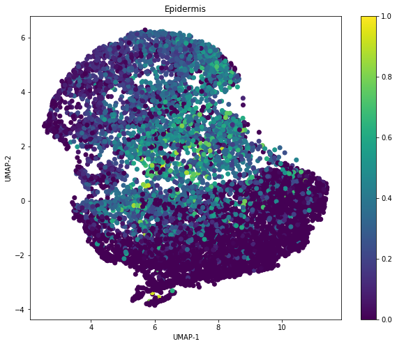

% Example Document
% S.M.Thomas
% 9th October 2020

<!-- TABLE OF CONTENTS INSERTED HERE -->

# Hello world

And here is some writing to get the ball rolling. It should automatically wrap so that there is no awkward continuation of everything and all the words that come to meet it. It should actually be set manually in the `~/.vimrc` file.


## Sub-Section

Here you can include subsections, possibly about the fact that Japanese culture is absolutely amazing and close to my heart [@smt20].


Mathematics is made possible with MathJax as follows:

$$
y = mx + 2 \\
2 + 2 = 4
$$

And then also inline $x + 2 = y$ like this!


## Coding

A number of languages are available for syntax-highlighting. It is a bit of a pain but it is fully customisable.

```python
for i in range(10):
    print("hello world", i)
```


<hr>

# Citing Literature


Here is a multi-reference [@wrigstad2017mastery;@smt20], noticing that it includes hyper-links to the reference
section.

You can also add images.




<figcaption markdown="1">**Fig.1** - A random plot.</figcaption>

There is also a separate list formated as normal:

1. One
2. Two
3. Three

and ...

- listItemOne
- listItemTwo
- listItemThree

After the reference heading below, pandoc will add the bibliography.

<hr>

# References


